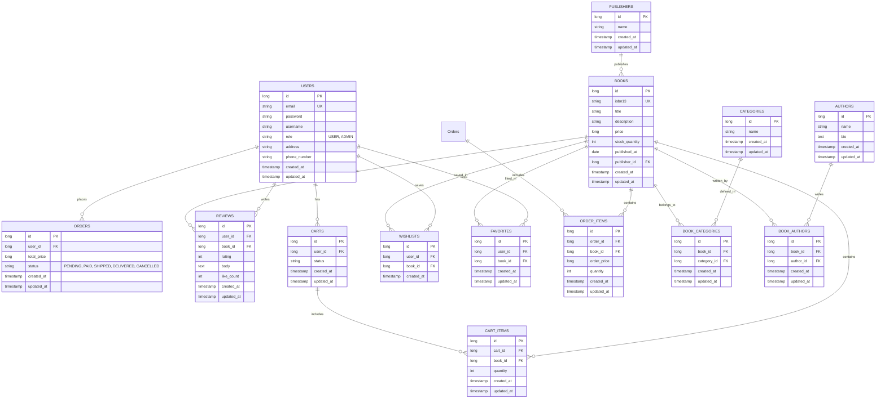

# Database Schema

## 1. ER Diagram

## 2. 테이블 상세 설명

### Users (사용자)
- `email`: 사용자 이메일 (Unique)
- `username`: 사용자 이름 (실명)
- `role`: `USER` / `ADMIN`
- `address`, `phone_number`: 배송 및 연락처 정보
- `created_at`, `updated_at`: 가입일 및 수정일

### Books (도서)
- `isbn13`: 13자리 국제 표준 도서 번호 (Unique)
- `title`: 도서 제목
- `description`: 도서 설명
- `stock_quantity`: 재고 수량 (Check: `>= 0`)
- `publisher_id`: 출판사 외래키
- `price`: 현재 판매가 (Check: `>= 0`)
- `published_at`: 출판일

### Authors (작가) / Publishers (출판사) / Categories (카테고리)
- `bio`: 작가 소개
- 도서와 작가/카테고리는 **Many-to-Many** 관계이며, `book_authors`, `book_categories` 연결 테이블을 통해 관리됩니다.

### Orders (주문) / OrderItems (주문 상세)
- `total_price`: 주문 총액
- `status`: 주문 상태 (`PENDING`, `PAID`, `SHIPPED`, `DELIVERED`, `CANCELLED`)
- `order_price`: **주문 시점의 도서 가격**을 저장하여, 이후 도서 가격 변동에 영향을 받지 않음 (Check: `>= 0`)
- `quantity`: 주문 수량 (Check: `> 0`)

### Reviews (리뷰)
- `body`: 리뷰 본문 (`content` -> `body`)
- `rating`: 1~5점 평점 (Check: `1 <= rating <= 5`)
- `like_count`: 좋아요 수 (Check: `>= 0`)

### Carts (장바구니) / CartItems (장바구니 아이템)
- `status`: 장바구니 상태 (활성 여부 등)
- `quantity`: 담은 수량 (Check: `> 0`)

### Favorites (즐겨찾기: 좋아요)
- `user_id`, `book_id`: 사용자가 '좋아요' 표시한 도서 목록
- Unique Constraint: `(user_id, book_id)` 중복 불가

### Wishlists (위시리스트: 찜하기)
- `user_id`, `book_id`: 사용자가 '찜'한 도서 목록
- Unique Constraint: `(user_id, book_id)` 중복 불가
- `created_at`만 존재 (수정 개념 없음)
